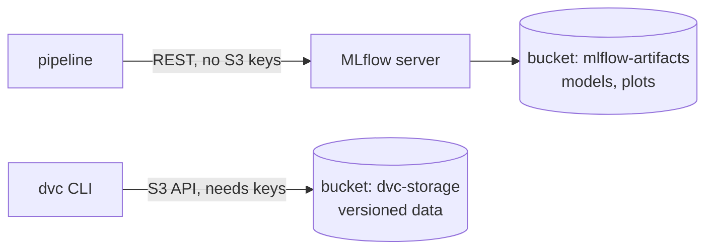
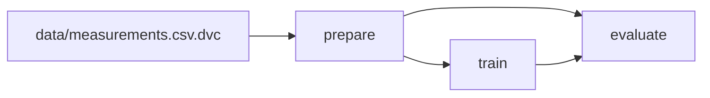
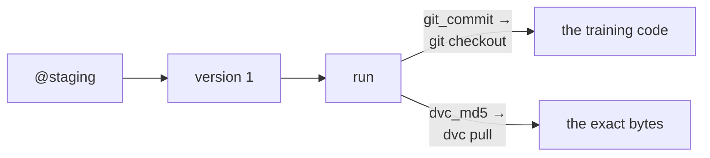

# Week 4: Data Versioning

<carbon-data-base class="icon-corner" />

**Lifecycle of Artificial Intelligence Systems**

- What it means to version data, and why Git cannot do it
- DVC: pointers in Git, bytes in object storage
- `dvc.yaml`: the pipeline as a declared graph
- Linking a data version to an MLflow run

<!--
Focus: today the traceability chain from last week reaches the data.
-->

---

# Last week: a record somebody else can check

<Lifecycle stage="design" width="62%" />

- **Tracking:** params, metrics, tags and artifacts for every run
- **Registry:** a named model, immutable versions, movable aliases
- **Traceability:** alias → version → run → params, metrics, `git_commit`

<!--
Focus: one minute. The quiz on the next slides does the real recap.
-->

---
layout: center
---

# **Quiz**
# Which one can change?
# A model version, or an alias?

<div v-click>

**The alias.** A version never changes.

An alias is a name that can move to another version.


</div>

<!--
Focus: immutable history, movable pointers.
Ask: let the room answer before you click.
-->

---
layout: center
---

# **Quiz**
# A run has the best F1 in the sweep.
# Is it ready to deploy?

<div v-click>

**No.** Winning a sweep is not a decision.

Someone must validate and approve the model before it is deployed.

</div>

<!--
Focus: a metric compares runs; a person decides what ships.
Ask: let the room answer before you click.
-->

---
layout: center
---

# **Quiz**
# A run records its `git_commit`.
# Can you rebuild the model from it?

<div v-click>

**Not always.** The code that ran can differ from the commit.

</div>
<div v-click>

> [!TIP]
> A pipeline triggered by the commit runs the training.

</div>
<div v-click>

A model is code **and** data. The commit fixes only the code.

</div>

<!--
Focus: a commit hash is evidence only if the run used exactly that commit. CI pipelines come in Week 7. The last line leads into today's problem.
Ask: let the room answer before you click.
-->

---

# Recap: Last week's chain stopped at a file path

<carbon-link class="icon-corner" />

```
models:/diabetes-classifier@staging
  -> version 1 -> run 30b3dfb2 -> params, metrics, git_commit
  -> data/diabetes.csv                  <- and here it stopped
```

> [!WARNING]
> The run records the file's **path**, not its **content**.

- Someone edits one row: the path stays the same, the data does not.
- The logged metrics now describe data that no longer exists.
- Nobody can train on the same rows again.

<!--
Focus: this is today's problem. Ask the room: has anyone overwritten a data file and kept the old name?
-->

---
layout: section
---

# 1 · When nobody knows the training data

<!--
Focus: first the problem, from outside the course.
-->

---
layout: image-right
image: /x-ray.png
backgroundSize: contain
---

# 2020: AI to diagnose COVID-19

**The situation.** In early 2020, hospitals needed fast ways to diagnose COVID-19.

- Chest X-rays and CT scans are fast and widely available.
- Many research groups had already trained models to analyse X-rays and CT scans.
- In 2020, they adapted these models to COVID-19.
- Public image datasets appeared within weeks.

**The question:** were any of these models ready for use in hospitals?

<!--
Focus: the task was urgent and reasonable. This is not a story about bad researchers.
-->

---
layout: fact
---

<div class="flex justify-center items-start gap-3 text-center">
  <div v-click class="w-40"><div class="text-5xl font-bold">2,212</div><div>studies found</div></div>
  <div v-click class="flex gap-3"><div class="text-5xl">→</div><div class="w-40"><div class="text-5xl font-bold">415</div><div>screened</div></div></div>
  <div v-click class="flex gap-3"><div class="text-5xl">→</div><div class="w-40"><div class="text-5xl font-bold">62</div><div>reviewed in full</div></div></div>
  <div v-click class="flex gap-3"><div class="text-5xl">→</div><div class="w-40"><div class="text-5xl font-bold">0</div><div>of potential clinical use</div></div></div>
</div>

<br>

Studies of COVID-19 imaging models, 1 January – 3 October 2020[^1][]

[^1]: Roberts et al., "Common pitfalls and recommendations for using machine learning to detect and prognosticate for COVID-19 using chest radiographs and CT scans", *Nature Machine Intelligence* 3, 199–217 (2021). https://doi.org/10.1038/s42256-021-00307-0 · Search window: 1 Jan – 3 Oct 2020.

<!--
Focus: none of the 62 models was of potential clinical use.
Ask: before the last click, let the room guess how many were.
If a student finds "61": that is the preprint; the published paper says 62.
-->

---

# "Frankenstein datasets"

<carbon-copy class="icon-corner" />

The authors named a cause[^1][]:

- public datasets were **built from other public datasets**
- then **republished under a new name**
- until nobody could say what was inside

**What can go wrong when you train and test a model on such datasets?**

<v-click>

> [!WARNING]
> The same images could be in the training data **and** the test data.

</v-click>

[^1]: Roberts et al., *Nature Machine Intelligence* 3, 199–217 (2021).

<!--
Focus: a model is only as checkable as its training data.
Ask: gather two or three answers before the click. Then ask what this does to the test score: it looks better than it really is.
-->

---

# The fix: dataset identity

<carbon-certificate class="icon-corner" />

Requirements today:

- publish **which exact version** of a dataset you used
- document **where the data came from** and how it was put together[^1][]
- keep test data **separate by source**, not only by random split

**Today's goal:** a dataset with versions, and a record of which version trained which model.

[^1]: Gebru et al., "Datasheets for Datasets", *Communications of the ACM* 64(12), 86–92 (2021). https://doi.org/10.1145/3458723

<!--
Focus: documentation is one half, versioning is the other. We build the versioning half.
-->

---
hide: true
---

# Option B · Face datasets that were withdrawn

<carbon-face-activated class="icon-corner" />

**The situation.** Face recognition research used large public benchmark datasets, such as **MS-Celeb-1M** and **DukeMTMC**.

- Both were **retracted** by their creators.
- A study of these two and a third dataset (LFW) followed nearly **1,000 papers** that cite them[^1][].

**The question:** once a dataset is withdrawn, can anyone say which models still use it?

[^1]: Peng, Mathur and Narayanan, "Mitigating dataset harms requires stewardship: Lessons from 1000 papers", NeurIPS Datasets and Benchmarks (2021). https://arxiv.org/abs/2108.02922

<!--
Option B for the cold open: use it instead of the COVID case (switch `hide` on the four COVID slides).
Focus: withdrawing a dataset does not withdraw the copies.
-->

---
hide: true
---

# Option B · What they missed: copies and derived datasets

<carbon-copy class="icon-corner" />

- **Derived datasets and models** built from them stayed in use after the retraction[^1][].
- **Unclear licences** and **poor dataset management** made it hard to know what was built from what.

**Best practice today:** look after a dataset for its whole life: versions, licence, and a record of what was built from each version.

[^1]: Peng, Mathur and Narayanan, NeurIPS Datasets and Benchmarks (2021). https://arxiv.org/abs/2108.02922

<!--
Option B, second slide.
Focus: "which models used this version?" must be a question you can answer.
-->

---

# Where we are: the data behind the model

<Lifecycle stage="design" width="70%" />

We are still in **development**. Today the **data** gets the same care as the code.

<!--
Focus: we are still in design. Before we build, we must know exactly which data we have.
-->

---
layout: section
---

# 2 · Version data?

<!--
Focus: the concept first, without any tool.
-->

---
layout: center
---

# Git already stores every file under its hash.
# Why not just commit the data to Git?

<!--
Ask: collect two or three answers before the next slide. They know Git well, so push for concrete reasons.
-->

---

# Git is really not for data...

<carbon-warning-alt class="icon-corner" />

Git keeps every version of every file, in every clone, for ever.

For code, that is what you want. For data, it hurts:

<v-clicks>

- a 200 MB file committed ten times is 2 GB in **every** clone
- a diff of a binary file tells you nothing
- you cannot delete it later: the history keeps it
- GitHub blocks files larger than 100 MiB[^1][]

</v-clicks>

[^1]: GitHub Docs, "About large files on GitHub". https://docs.github.com/en/repositories/working-with-files/managing-large-files/about-large-files-on-github

<!--
Focus: Git is excellent for text. Data needs a different store.
Ask: collect the room's answers first, then click through the list.
-->

---
hide: true
layout: image-right
image: /era-5.png
backgroundSize: contain
---

# THE weather dataset: ERA5

**The industry.** Weather and energy companies use **ERA5**, a record of the past weather for the whole globe, hour by hour, from ECMWF. Studies of wind and solar power output use it[^1][].

**The problem.** For the years **2000–2006**, ERA5 had a **cold bias of about 0.5–1 K** in the lower stratosphere[^2][].

[^1]: Wilczak et al., "Evaluation and Bias Correction of the ERA5 Reanalysis over the United States for Wind and Solar Energy Applications", *Energies* 17(7), 1667 (2024).
[^2]: Simmons et al., "Global stratospheric temperature bias and other stratospheric aspects of ERA5 and ERA5.1", ECMWF Technical Memorandum 859 (Jan 2020).

<!--
Option B for this slot: use it instead of the fraud case (switch `hide` on the three ERA5 slides and the two fraud slides).
Focus: reanalysis = the best estimate of past weather, built from observations and a model. Explain it in one sentence.
-->

---
hide: true
---

# The fix got a new name: ERA5.1

<carbon-version class="icon-corner" />

- ECMWF **re-ran 2000–2006** with a corrected setting and published it as a separate dataset: **ERA5.1**[^1][].
- So "ERA5 for 2003" can mean **two different datasets**.
- A model trained last year and a model trained today may have seen different data, **under the same name**.

> [!TIP]
> Record the provider's exact product and version, and for your own copies, a **content hash**.

[^1]: Simmons et al., ECMWF Technical Memorandum 859 (Jan 2020). https://www.ecmwf.int/sites/default/files/elibrary/2020/81149-global-stratospheric-temperature-bias-and-other-stratospheric-aspects-era5-and-era51.pdf

<!--
Option B, second slide.
Focus: a good provider gives the fix a new name. Your own datasets need the same.
Be honest if asked: the bias is high in the atmosphere, so a surface wind model may barely change. The point is being able to say which one you used.
-->

---
hide: true
---

# ERA5 was also fixed in place

<carbon-warning-alt class="icon-corner" />

In 2021, ECMWF found **a few hundred corrupted fields**, out of **3.1 billion**, in two ERA5 hourly datasets on its Climate Data Store[^1][].

<div class="flow">
  <div class="node"><ph-download-simple class="ic" />You download<br>ERA5 files</div>
  <div class="arrow">→</div>
  <div class="node"><ph-wrench class="ic" />Files fixed in place<br><small>14 April and 21 July 2021</small></div>
  <div class="arrow">→</div>
  <div class="node"><ph-files class="ic" />Same name,<br>different bytes</div>
</div>

ECMWF asked users to **re-download** files they got before the fix. Is your copy from before or after?

> [!TIP]
> Record the hash of every file you download. Then you can check your copy at any time.

[^1]: ECMWF, "ERA5 CDS: Data corruption", Copernicus Knowledge Base (last updated 2 October 2024). https://confluence.ecmwf.int/display/CKB/ERA5+CDS:+Data+corruption

<!--
Option B, third slide.
Focus: a provider can change the bytes without changing the name. Only your own record of the hash tells you which copy you have.
The corruption showed as a line or band of wrong values across a latitude. The copies in ECMWF's MARS archive were not affected. The page gives no checksums, so users cannot check old downloads.
-->

---

# Fraud labels arrive weeks later

<carbon-purchase class="icon-corner" />

**The industry.** Card payments. A model scores each transaction and flags possible fraud.

<div class="flow">
  <div class="node" style="width:12rem"><ph-credit-card class="ic" /><b>Day 0</b><br>A payment is made<br><small>label: genuine</small></div>
  <div class="arrow">→</div>
  <div class="node" style="width:12rem"><ph-calendar class="ic" /><b>Days and weeks</b><br>The cardholder reads the statement</div>
  <div class="arrow">→</div>
  <div class="node" style="width:12rem"><ph-warning class="ic" style="color:#dc2626" /><b>A dispute arrives</b><br>The label changes<br><small>label: fraud</small></div>
</div>

**The problem.** A payment counts as genuine unless the cardholder disputes it. Most labels are known only **"after several days (e.g. one month)"**[^1][].

> [!WARNING]
> The **same month** of data has **different labels**, depending on when you copy it.

[^1]: Dal Pozzolo et al., "Credit Card Fraud Detection: A Realistic Modeling and a Novel Learning Strategy", *IEEE Trans. Neural Networks and Learning Systems* 29(8), 3784–3797 (2018). Data: 54.8 million transactions over 296 days.

<!--
Main case for this slot. The hidden ERA5 slides are the alternative.
Focus: "last month's data" is not one dataset. It depends on the day you take it.
-->

---

# Freeze a snapshot, and record which one

<carbon-camera class="icon-corner" />

You copy **March** twice and retrain each time. Are the two copies the same?

<div v-click>
<div class="flow" style="margin:0.4rem 0">
  <div class="node" style="width:16rem"><ph-calendar class="ic" />March, copied on 1 April<br><small>some disputes still missing</small></div>
  <div class="arrow">→</div>
  <div class="node" style="width:8rem"><ph-hash class="ic" />hash A</div>
  <div class="arrow">→</div>
  <div class="node" style="width:8rem"><ph-cube class="ic" />model A</div>
</div>
<div class="flow" style="margin:0.4rem 0">
  <div class="node" style="width:16rem"><ph-calendar class="ic" />March, copied on 1 May<br><small>more disputes arrived</small></div>
  <div class="arrow">→</div>
  <div class="node" style="width:8rem"><ph-hash class="ic" />hash B</div>
  <div class="arrow">→</div>
  <div class="node" style="width:8rem"><ph-cube class="ic" />model B</div>
</div>
</div>

<v-click>

> [!TIP]
> Take a dated snapshot, give it a version, and record its **content hash** with the model.

</v-click>

<!--
Focus: versioning is what turns "last month's data" into one exact dataset. Without the hash, nobody can explain why model A and model B differ.
Ask: let the room answer the question before the first click.
-->

---

# What is a hash?

<ph-hash class="icon-corner" />

A **hash function** turns any input into a short, fixed-length fingerprint.

<div class="flow">
  <div class="node"><ph-file-csv class="ic" /><span class="mono">6,148,72,35,0,33.<b>6</b>,0.627,50,1</span></div>
  <div class="arrow">→</div>
  <div class="node"><b>md5</b></div>
  <div class="arrow">→</div>
  <div class="node mono">a08191bbcd6221f06a9c23efe7263d38</div>
</div>

<div v-click class="flow">
  <div class="node"><ph-file-csv class="ic" /><span class="mono">6,148,72,35,0,33.<span class="changed">7</span>,0.627,50,1</span></div>
  <div class="arrow">→</div>
  <div class="node"><b>md5</b></div>
  <div class="arrow">→</div>
  <div class="node mono"><span class="changed">094517dc7d352d3d8b39a247ad17134c</span></div>
</div>

<v-clicks>

- The same input always gives the same hash.
- Change one character, and the whole hash changes.
- You cannot rebuild the data from its hash.

</v-clicks>

<!--
Focus: the input is the first patient row of our dataset; the second has BMI 33.7.
Ask: before the click, how much of the hash will change?
If asked: MD5 is not safe against forgery, but fine for noticing a change.
-->

---

# A content hash is computed from the data

<carbon-fingerprint-recognition class="icon-corner" />

```
data/measurements.csv (461 rows)  ->  md5  ->  786c54f2770fa1e7ea5438e6e44b6486
```

- Change one byte and the hash changes.
- Nobody has to remember to rename anything.
- The name **cannot drift** from the data.

> [!NOTE]
> **Content-addressed storage:** each object is stored under a name computed from its content.

<!--
Focus: the identity comes from the content, so "same name" means "same data".
-->

---

# Counter-case: when is this too much?

<carbon-scales class="icon-corner" />

Our dataset is **31,750 bytes**. Git could store it without any problem.

DVC adds costs: a remote, keys, a second `push`, a cache to manage.

- **Worth it:** large data, data that changes, data shared between projects.
- **Too much:** a small file that never changes. Keep it in Git.
- **A public dataset with official versions** (like ERA5.1): record the provider's version.

> [!TIP]
> Whatever you choose, record the **hash** of the data, so you can check your copy later.

<!--
Focus: we use DVC here because the dataset grows (three batches) and to learn the pattern, not because 31 KB needs it.
Ask: does your own project need DVC?
-->

---

# Split the job

<div class="flow">
  <div class="node"><ph-file-csv class="ic" />data/diabetes.csv</div>
  <div class="arrow">→</div>
  <div class="flex flex-col gap-4">
    <div class="flow" style="margin:0">
      <div class="node" style="width:13rem"><ph-file-text class="ic" />Pointer file<br><small>path + hash, a few lines</small></div>
      <div class="arrow">→</div>
      <div class="node" style="width:13rem"><carbon-logo-git class="ic" style="color:#f05032" /><b>Git</b><br><small>GitHub, GitLab</small></div>
    </div>
    <div class="flow" style="margin:0">
      <div class="node" style="width:13rem"><ph-files class="ic" />The data itself<br><small>large files</small></div>
      <div class="arrow">→</div>
      <div class="node" style="width:13rem"><b>Object store</b><br><small>MinIO, Amazon S3, Azure Blob</small></div>
    </div>
  </div>
</div>

- **Git** keeps a small file that names the data (the hash).
- **An object store** keeps the data itself, under that hash.

You already run an object store: **Silo**, since Week 2.

<!--
Focus: the same split as Week 2, now for data.
-->

---
layout: section
---

# 3 · Data version control

<!--
Focus: now the tools that implement the split.
Ask: who has used, or heard of, a tool that versions data?
-->

---
class: fn-inline
---

# Many tools version data

<carbon-tool-box class="icon-corner" />

<div class="cards" style="grid-template-columns:repeat(5,1fr)">
  <div class="card"><div class="logo" style="background-image:url(/dvc-logo.svg)"></div><b>DVC</b>Git-based, for data science projects<br><code>md5: 786c54f2…</code></div>
  <div class="card"><div class="logo" style="background-image:url(/lakefs-logo.png)"></div><b>lakeFS</b>branches and commits over object storage</div>
  <div class="card"><div class="logo" style="background-image:url(/git-lfs-logo.png)"></div><b>Git LFS</b>pointers in Git, large files on a server<br><code>oid sha256:…</code></div>
  <div class="card"><div class="logo" style="background-image:url(/delta-lake-logo.png)"></div><b>Delta Lake</b>tables with versions and "time travel"<br><code>VERSION AS OF 12</code></div>
  <div class="card"><div class="logo" style="background-image:url(/dolt-logo.png)"></div><b>Dolt</b>a SQL database with Git-style branches</div>
</div>

<div class="text-sm opacity-70">

Sources: DVC[^1][] · lakeFS[^2][] · Git LFS[^3][] · Delta Lake[^4][] · Dolt[^5][] · S3 versioning[^6][]

</div>

<v-click>

**DVC and Git LFS name data by its content.** Delta Lake and S3 bucket versioning give each write a new version number or ID.

</v-click>
<v-click>

**Why DVC here:** open source, works next to Git, and stores data in any S3-compatible bucket, like our Silo.

</v-click>

[^1]: DVC blog, "DVC Joins lakeFS: Your Questions Answered!" (18 Nov 2025). https://dvc.org/blog/dvc-joins-lakefs-your-questions-answered/
[^2]: lakeFS. https://lakefs.io/
[^3]: Git LFS specification. https://github.com/git-lfs/git-lfs/blob/main/docs/spec.md
[^4]: Delta Lake blog, "Delta Lake Time Travel" (Feb 2023). https://delta.io/blog/2023-02-01-delta-lake-time-travel/
[^5]: Dolt, README. https://github.com/dolthub/dolt
[^6]: AWS docs, "Retaining multiple versions of objects with S3 Versioning". https://docs.aws.amazon.com/AmazonS3/latest/userguide/Versioning.html

<!--
Focus: DVC is one tool among several. The practice (a content identity for data) is what students take to their next team.
Ask: before the first click, which of these name data by its content?
In November 2025 lakeFS bought DVC from Iterative.ai. DVC stays open source under the same licence, for small and medium projects; lakeFS targets petabyte-scale data lakes.
-->

---

# Meet DVC (Data Version Control)

<div class="logo" style="height:3.5rem;width:12rem;background:url(/dvc-logo.png) left center / contain no-repeat"></div>

<div class="cards" style="grid-template-columns:repeat(4,1fr)">
  <div v-click class="card"><carbon-logo-git class="ic" style="color:#f05032" /><b>Works with Git</b>Git keeps the history</div>
  <div v-click class="card"><ph-hash class="ic" /><b>Tracks files by hash</b>the content hash is the name</div>
  <div v-click class="card"><ph-cloud-arrow-up class="ic" /><b>Stores the bytes in a remote</b>for us: a Silo bucket</div>
  <div v-click class="card"><carbon-flow class="ic" /><b>Runs pipelines</b>re-runs only what changed</div>
</div>

In DVC's own words, it is *"technically not a version control system by itself"*[^1][]. Git does the versioning.

[^1]: DVC documentation, "Get Started with DVC". https://doc.dvc.org/start/data-management/data-versioning

<!--
Focus: DVC has no history of its own. The history is Git's.
-->

---

# Install DVC and start a project

<carbon-terminal class="icon-corner" />

```bash {1|2|3|all}
uv add "dvc[s3]"                  # the [s3] extra adds S3 and S3-compatible stores
dvc init                          # run it inside a Git repository
git commit -m "Initialise DVC"
```

`dvc init` creates a small folder and stages it with `git add`[^1][]:

```
.dvc/
├── .gitignore    keeps the cache out of Git
└── config        settings, such as the remote
.dvcignore        files DVC should not look at
```

> [!TIP]
> In the lab, the DVC project is a subfolder of the course repository, so it uses `dvc init --subdir`.

[^1]: DVC docs, "init". https://doc.dvc.org/command-reference/init

<!--
Focus: setting up DVC takes one package and one command. The cache folder appears later, on the first `dvc add`.
-->

---

# `dvc add` writes a pointer file

<carbon-document-blank class="icon-corner" />

```yaml {2|3|4|5|all}
outs:
- md5: 786c54f2770fa1e7ea5438e6e44b6486
  size: 19034
  hash: md5
  path: measurements.csv
```

This `measurements.csv.dvc` file goes into Git **instead of** the 19 KB of data.

- `md5`: the hash of the bytes, and their address in storage
- `size`: checked before a download
- `hash`: which algorithm was used
- `path`: relative to this `.dvc` file

<!--
Focus: four fields, about a hundred bytes. Students will read this file on their own disk in Exercise 2.
-->

---

# Where the pointer lives, and where the bytes go

<div class="flow">
  <div class="node" style="width:15rem"><ph-folder-open class="ic" /><b>Your workspace</b><br><span class="mono">data/measurements.csv<br>data/measurements.csv.dvc</span></div>
  <div class="flex flex-col gap-2">
    <div class="flow" style="margin:0">
      <div class="arrow-l">git add, git commit<span class="arrow">→</span></div>
      <div class="node" style="width:16rem"><carbon-logo-git class="ic" style="color:#f05032" /><b>Git</b><br><span class="mono">measurements.csv.dvc<br>md5: 786c54f2…</span></div>
    </div>
    <div class="text-sm text-right pr-20 opacity-80">↕ the md5 is the address</div>
    <div class="flow" style="margin:0">
      <div class="arrow-l">dvc push<span class="arrow">⇄</span>dvc pull</div>
      <div class="node" style="width:16rem"><ph-hard-drives class="ic" /><b>Silo: dvc-storage</b><br><span class="mono">files/md5/78/6c54f2…<br>(the 19,034 bytes)</span></div>
    </div>
  </div>
</div>

> [!TIP]
> `dvc add` also writes `data/.gitignore`, so Git does not track the data file too.

<!--
Focus: Git and DVC never manage the same bytes.
-->

---

# `dvc push`: upload data

<carbon-cloud-upload class="icon-corner" />

<div class="flow">
  <div class="node" style="width:12rem"><ph-folder-open class="ic" /><b>Workspace</b><br><span class="mono">data/measurements.csv</span></div>
  <div class="arrow-l dim">dvc add<span class="arrow">→</span></div>
  <div class="node" style="width:12rem"><ph-archive class="ic" /><b>Local cache</b><br><span class="mono">.dvc/cache</span></div>
  <div class="arrow-l on">dvc push<span class="arrow">→</span></div>
  <div class="node" style="width:12rem"><ph-hard-drives class="ic" /><b>Remote</b><br><span class="mono">Silo: dvc-storage</span></div>
</div>

- Uploads the files your `.dvc` files point to, from the cache to the remote[^1][].
- Skips files the remote already has: it compares the hashes.
- Run it next to `git push`: Git gets the pointer, the remote gets the data.

[^1]: DVC docs, "push". https://doc.dvc.org/command-reference/push

<!--
Focus: push moves bytes between two machines, never touches the workspace.
-->

---

# `dvc pull`: download data

<carbon-cloud-download class="icon-corner" />

<div class="flow">
  <div class="node" style="width:12rem"><ph-folder-open class="ic" /><b>Workspace</b><br><span class="mono">data/measurements.csv</span></div>
  <div class="arrow-l on">checkout<span class="arrow">←</span></div>
  <div class="node" style="width:12rem"><ph-archive class="ic" /><b>Local cache</b><br><span class="mono">.dvc/cache</span></div>
  <div class="arrow-l on">fetch<span class="arrow">←</span></div>
  <div class="node" style="width:12rem"><ph-hard-drives class="ic" /><b>Remote</b><br><span class="mono">Silo: dvc-storage</span></div>
</div>

- Downloads the data your `.dvc` files point to, into the cache, then into the workspace.
- It is `dvc fetch` and `dvc checkout` in one command[^1][].
- Use it after `git clone` or `git pull`: Git brings the pointers, `dvc pull` brings the data.

[^1]: DVC docs, "pull". https://doc.dvc.org/command-reference/pull

<!--
Focus: pull is the only command that goes all the way from the remote to your disk.
-->

---

# `dvc checkout`: restore from the cache

<carbon-renew class="icon-corner" />

<div class="flow">
  <div class="node" style="width:12rem"><ph-folder-open class="ic" /><b>Workspace</b><br><span class="mono">data/measurements.csv</span></div>
  <div class="arrow-l on">dvc checkout<span class="arrow">←</span></div>
  <div class="node" style="width:12rem"><ph-archive class="ic" /><b>Local cache</b><br><span class="mono">.dvc/cache</span></div>
  <div class="arrow-l dim"><span class="arrow">↔</span></div>
  <div class="node dim" style="width:12rem"><ph-hard-drives class="ic" /><b>Remote</b><br><span class="mono">Silo: dvc-storage</span></div>
</div>

- Makes the workspace match the `.dvc` files, using **only** the local cache[^1][].
- Use it after `git checkout` has moved a pointer to another version.
- It never uses the network.

[^1]: DVC docs, "checkout". https://doc.dvc.org/command-reference/checkout

<!--
Focus: checkout is fast and offline, which is also its limit. The next slides show what happens when the cache is empty.
-->

---

# Five commands: what moves where?

<carbon-arrows-horizontal class="icon-corner" />

| Command | Moves | From | To |
| --- | --- | --- | --- |
| `dvc init` | nothing | — | <span v-click="1">creates `.dvc/` in the Git repo: the config, and later the local cache</span> |
| `dvc add` | your file | <span v-click="2">workspace</span> | <span v-click="3">local cache (and writes the pointer)</span> |
| `dvc push` | the bytes | <span v-click="4">local cache</span> | <span v-click="5">remote (Silo)</span> |
| `dvc pull` | the bytes | <span v-click="6">remote</span> | <span v-click="7">cache, then workspace</span> |
| `dvc checkout` | the bytes | <span v-click="8">local cache</span> | <span v-click="9">workspace</span> |

<!--
Focus: fill it in together. The question is always "between which two places?"
-->

---

# Quiz · Week 2: where does each output live?

<carbon-help class="icon-corner" />

| Output | Store | Why |
| --- | --- | --- |
| Params, metrics, tags | <span v-click="1">Postgres</span> | <span v-click="3">small, structured, easy to query</span> |
| The model file, plots | <span v-click="2">Silo</span> | <span v-click="4">large files, fetched whole</span> |

<br>

<v-click at="5">

Today Silo gets a second job: it also stores **the data**.

</v-click>

<!--
Focus: fill the table in together; it sets up the next slide.
Ask: "what goes here?" before each click.
-->

---

# Silo now stores two kinds of things



- MLflow **proxies** artifacts, so your pipeline needs no storage keys.
- DVC talks to Silo **directly**, so it needs keys of its own.

The lab's Makefile passes the Silo keys from `.env` to DVC.

Nothing secret goes into a committed file.

<!--
Focus: the one place where the Week 2 credential story changes.
-->

---

# Going back to version 1

<carbon-time class="icon-corner" />

```bash {1|all}
git checkout HEAD~1 -- data/measurements.csv.dvc   # move the pointer
dvc checkout                                       # move the bytes
```

| | Knows about | Cannot |
| --- | --- | --- |
| `git checkout` | commits, pointers, code | put the data on your disk |
| `dvc checkout` | pointers, cache, bytes | tell you which version you want |

**Git chooses the version. DVC delivers it.**

<!--
Focus: after the first command, the pointer and the data on disk disagree. The second command fixes that.
-->

---

# Storing by hash removes duplicates for free

```
dvc-storage/dvcstore/files/md5/78/6c54f2770fa1e7ea5438e6e44b6486
                               ^^ ^^^^^^^^^^^^^^^^^^^^^^^^^^^^^^
                          first 2 characters     the other 30
```

- Push the same data twice: the second push uploads **nothing**.
- Ten branches with the same dataset store **one** copy.
- Damaged files can be found: hash the bytes again and compare.

<ImageSlot id="w04-silo-md5" text="Screenshot: the Silo console showing dvc-storage/dvcstore/files/md5/78/…" height="110px" />

<!--
Focus: these follow from the design; nobody had to build them as features.
-->

---
layout: section
---

# 4 · The pipeline as a graph

<!--
Focus: versioned data is the first input. Now the steps that use it.
-->

---

# Hyperparameters move from `.env` to `params.yaml`

<carbon-document-tasks class="icon-corner" />

**DVC can only hash files.** A value set in an environment variable is invisible to it.

```yaml
random_seed: 42
prepare:
  test_size: 0.25
train:
  family: logreg
  C: 1.0
```

<br>

> [!NOTE]
> **Rule:** if a value can change the result, it must live in a file the pipeline tracks.

<!--
Focus: otherwise the pipeline's record could be complete and still wrong about C.
-->

---

# Pipeline stages

<carbon-flow class="icon-corner" />

```yaml
stages:
  prepare:
    cmd: uv run python src/main.py prepare
    deps:
      - data/measurements.csv
      - src/week_04_dvc_introduction/data.py
    params: [random_seed, prepare.test_size]
    outs:
      - data/processed/train.csv
      - data/processed/test.csv
```

What it **runs** (`cmd`), what it **reads** (`deps`), which **params** it uses, and what it **writes** (`outs`).

Source files are `deps` too. Edit `data.py`, and `prepare` must run again.

<!--
Focus: this is the stage the starter already has. Students write the other two in Exercise 5.
-->

---

# Run the pipeline

<carbon-play class="icon-corner" />

```bash
dvc repro     # run every stage that is out of date, in order
dvc status    # show which deps and outs changed since the last run
dvc dag       # draw the graph of stages
```

How `dvc repro` decides, for each stage:

<div class="flow">
  <div class="node" style="width:11rem"><ph-git-diff class="ic" />Hash the <b>deps</b>,<br>read the <b>params</b></div>
  <div class="arrow">→</div>
  <div class="node" style="width:11rem"><ph-question class="ic" />Same as the<br>last run?</div>
  <div class="flex flex-col gap-2">
    <div class="flow" style="margin:0"><div class="arrow-l">yes<span class="arrow">→</span></div><div class="node" style="width:13rem"><ph-skip-forward class="ic" />skip the stage<br><small>"didn't change, skipping"</small></div></div>
    <div class="flow" style="margin:0"><div class="arrow-l">no<span class="arrow">→</span></div><div class="node" style="width:13rem"><ph-play class="ic" />run <code>cmd</code>, record<br>the new hashes</div></div>
  </div>
</div>

<!--
Focus: repro compares content, not time. The record of the last run is `dvc.lock`, two slides on.
Students run `make repro` twice in Exercise 5: the second run skips every stage.
-->

---
layout: center
---

# **Quiz**
# You run `touch data/measurements.csv`,
# then `dvc repro`. What runs?

<div v-click>

**Nothing.** `touch` changes the file's time, not its content. DVC compares hashes.

</div>

<!--
Focus: predict first, then see why on the next slide.
Ask: who expects every stage to run again?
-->

---

# `dvc repro` is like `make`, with one big difference

<carbon-repeat class="icon-corner" />

| | `make` | `dvc repro` |
| --- | --- | --- |
| **Decides by** | file modification **times** | content **hashes** |
| **`touch` a file** | rebuilds everything after it | nothing changes |
| **Restore an old version** | rebuilds | skips: the content is known |
| **Tracks params** | no | yes, by value |

`make` asks "is this newer?". DVC asks "is this **different**?"

<!--
Focus: only the second question is about your data.
-->

---

# The graph, drawn by `dvc dag`



This is the output of `dvc dag --mermaid` from this week's lab.

The versioned dataset is the **root** of the graph.

<!--
Focus: a generated diagram cannot drift from the pipeline it describes.
-->

---

# `dvc.lock` is the receipt

<carbon-receipt class="icon-corner" />

```yaml
prepare:
  cmd: uv run python src/main.py prepare
  deps:
  - path: data/measurements.csv
    md5: a8fd7b4f0d6d1bc4e378a8f76c5fff0c
    size: 31750
  params:
    params.yaml:
      prepare.test_size: 0.25
      random_seed: 42
```

- `dvc.yaml` is your **declared** pipeline: the stages you wrote by hand.
- `dvc.lock` is what **actually ran**: every hash, every parameter value.

> [!TIP]
> Always commit `dvc.lock` together with `dvc.yaml`. Without it, nobody can check what ran.

<!--
Focus: this example is version 3 of the data (768 rows, 31,750 bytes).
-->

---
layout: section
---

# 5 · Linking the data to the run

<!--
Focus: DVC knows the data, MLflow knows the run. Now connect them.
-->

---

# Last week's data tracking was **incomplete**

<carbon-tag class="icon-corner" />

```python
mlflow.log_params({"data_path": "diabetes.csv", "n_rows": 768})
```

A file name and a row count.

Both stay the same **when someone edits every value in the file**.

<!--
Focus: this is the Week 3 code students already know. It records where, not what.
-->

---

# Record the data version on the run

<carbon-tag class="icon-corner" />

<div class="flow">
  <div class="node" style="width:18rem"><ph-file-text class="ic" /><b>data/measurements.csv.dvc</b><br><span class="mono">md5: a8fd7b4f…</span></div>
  <div class="arrow-l">read the md5<span class="arrow">→</span></div>
  <div class="node text-left" style="width:18rem"><ph-flask class="ic" /><b>MLflow run: tags</b><br><span class="mono">git_commit = …<br>dvc_md5 &nbsp;&nbsp;= a8fd7b4f…<br>dvc_url &nbsp;&nbsp;= s3://dvc-storage/…</span></div>
</div>

- The hash is already in the `.dvc` file.
- Log it as a **tag**: tags exist so that someone can **find** a run!

```python
mlflow.set_tags({
    "dvc_md5": dvc_md5,
    "dvc_url": dvc_url,
})
```

- With `git_commit`, the run now names its code **and** its data.

> [!TIP]
> Tag every training run with the data hash, when the run is made.

<!--
Focus: the practice is "every run names the exact data". The tool calls are `mlflow.set_tags` in the lab's `log_data_version` (Exercise 6); do not show the code.
`dvc_url` is where DVC stored those bytes, from `dvc.api.get_url`.
-->

---

# A tag with the hash makes a new question possible

<carbon-search class="icon-corner" />

Every run now carries `dvc_md5`. Tags are searchable, so you can now ask:

```python
mlflow.search_runs(filter_string="tags.dvc_md5 = 'a8fd7b4f…'")
```

Not "which run scored best?" but **"which runs ever trained on this data?"**

<!--
Focus: students write the tagging code in Exercise 6. Do not show it here.
-->

---

# MLflow can log datasets too

<carbon-data-set class="icon-corner" />

MLflow has its own dataset API: `mlflow.data.from_pandas` and `mlflow.log_input`[^1][].

<div class="text-sm">

| It records | Example from our run |
| --- | --- |
| name and **context** | `diabetes-measurements`, `training` |
| **source**: where the data is | `s3://dvc-storage/…` |
| **schema** and **profile** | 9 columns, 768 rows |
| **digest**: its own hash | `9a465ecc` |
| **search** by it | `dataset.digest = '9a465ecc'` |

</div>

> [!WARNING]
> MLflow stores a **description** of the data, not the data. To get the bytes back, you still need DVC.

[^1]: MLflow docs, "Dataset tracking". https://mlflow.org/docs/latest/ml/dataset/

<!--
Focus: MLflow's dataset logging is good for seeing the data in the UI and searching by it. It is not a version store.
Measured on mlflow 3.13.0 with the lab's version 3 data (768 rows). The run page in the UI shows the logged dataset.
-->

---

# Two hashes of the same file that never agree

<carbon-hashtag class="icon-corner" />

| | DVC `md5` | MLflow `digest` |
| --- | --- | --- |
| **Hashes** | the file's raw **bytes** | the **values** of the first 10,000 rows, the row count and the column names |
| **Our file** | `a8fd7b4f0d6d1bc4e378a8f76c5fff0c` | `9a465ecc` |
| **Same values, Windows line endings** | changes: `d2384a69…` | stays `9a465ecc` |
| **Answers** | "are these the same bytes?" | "is this roughly the same table?" |

<v-click>

> [!TIP]
> For an auditor, use the **md5**. The digest is a quick check that a table changed.

</v-click>

<!--
Ask: which one would you give a regulator who asks you to reproduce the model?
Measured on mlflow 3.13.0. Editing one BMI value changes both hashes (digest 3748223f); only a change of format, not of values, separates them.
-->

---

# A photo app that had to delete its models

<carbon-face-activated class="icon-corner" />

**The industry.** Consumer photo storage: the **Ever** app, by Everalbum.

**What they did.** From 2017 to 2019 they combined **millions of user photos** with public datasets to build face recognition. The feature was on by default, without consent[^1][].

**The regulator.** The US Federal Trade Commission (FTC) settled with the company in **January 2021**.


[^1]: FTC press release, 11 Jan 2021. https://www.ftc.gov/news-events/news/press-releases/2021/01/california-company-settles-ftc-allegations-it-deceived-consumers-about-use-facial-recognition-photo

<!--
Focus: set the scene in one minute. The next slide is the part that matters for MLOps.
-->

---

# The order: delete the data, and every model built from it

<carbon-trash-can class="icon-corner" />

The settlement required Everalbum to delete[^1][]:

<div class="flow">
  <div class="node no-shrink" style="width:12rem"><ph-images class="ic" /><b>Photos and videos</b><br><small>of users who closed their accounts</small><div v-click="1" class="fail mt-1"><ph-trash /> delete</div></div>
  <div class="node no-shrink" style="width:12rem"><ph-user-focus class="ic" /><b>Face embeddings</b><br><small>made without consent</small><div v-click="1" class="fail mt-1"><ph-trash /> delete</div></div>
  <div class="node no-shrink" style="width:12rem"><ph-cube class="ic" /><b>Face recognition models</b><br><small>"developed with Ever users' photos or videos"</small><div v-click="1" class="fail mt-1"><ph-trash /> delete</div></div>
  <div v-click="2" class="node no-shrink" style="width:12rem;border-style:dashed"><ph-cube class="ic" /><b>Models from other data only</b><br><small>for example, bought or public datasets</small><div class="mt-1" style="color:#16a34a;font-weight:700"><ph-check-circle /> not named</div></div>
</div>

<v-click at="3">

**To obey an order like this, you must know which models were trained on which data.**

That is the link we are building: `tags.dvc_md5` on every run.

</v-click>

[^1]: FTC press release, 11 Jan 2021.

<!--
Focus: data lineage stops being "nice to have" when a regulator asks. The order is only as wide as the data: models trained without Ever users' photos are not named in it, but only if you can prove which data trained them.
Ask: with only Week 3's tracking, could you have found every affected model? And the ones you are allowed to keep?
-->

---
hide: false
---

# The law now asks where the data came from

<carbon-policy class="icon-corner" />

**The EU AI Act** (Regulation (EU) 2024/1689), Article 10, for **high-risk** AI systems[^1][].

<div class="flow" style="margin:0.3rem 0">
  <div v-click class="node no-shrink text-left" style="width:22rem"><ph-scales class="ic" style="display:inline;font-size:1.3rem" /> 10(2)(b): <b>"the origin of data"</b></div>
  <div v-click class="arrow">→</div>
  <div v-click class="node no-shrink text-left" style="width:22rem"><ph-map-pin class="ic" style="display:inline;font-size:1.3rem" /> the <code>.dvc</code> hash and <code>dvc_url</code></div>
</div>
<div class="flow" style="margin:0.3rem 0">
  <div v-click class="node no-shrink text-left" style="width:22rem"><ph-scales class="ic" style="display:inline;font-size:1.3rem" /> 10(2)(c): preparation, such as <b>"cleaning, updating"</b></div>
  <div v-click class="arrow">→</div>
  <div v-click class="node no-shrink text-left" style="width:22rem"><ph-git-branch class="ic" style="display:inline;font-size:1.3rem" /> <code>dvc.yaml</code> and <code>dvc.lock</code></div>
</div>
<div class="flow" style="margin:0.3rem 0">
  <div v-click class="node no-shrink text-left" style="width:22rem"><ph-scales class="ic" style="display:inline;font-size:1.3rem" /> 10(3): data <b>"free of errors and complete"</b></div>
  <div v-click class="arrow">→</div>
  <div v-click class="node no-shrink text-left dim" style="width:22rem"><ph-list-checks class="ic" style="display:inline;font-size:1.3rem" /> not yet: data validation is Week 5</div>
</div>

[^1]: Regulation (EU) 2024/1689, Art. 10. https://artificialintelligenceact.eu/article/10/

<!--
Shown after the Everalbum case: first an enforcement case, then the law. Hide it to shorten the section.
Focus: record-keeping about data is becoming a legal duty in the EU. Two of the three rows are covered by today's tools; the third is next week.
-->

---

# The chain, finally complete



Now **every arrow is one lookup**, possible months later, by someone who never saw the project.

<!--
Focus: code and data are both named exactly. That is what makes a model reproducible.
-->

---
layout: section
---

# 6 · Beyond one CSV file

<!--
Focus: the lab versions one CSV. Real projects have folders of images, databases and data owned by someone else. These slides are optional: hide them if time is short.
Ask: what kind of data does your own project use?
-->

---

# Handling images

<carbon-image class="icon-corner" />

<div class="flow">
  <div class="node no-shrink" style="width:12rem"><ph-folder-simple class="ic" /><b>data/scans/</b><br><small>3 image files</small></div>
  <div class="arrow-l">dvc add<span class="arrow">→</span></div>
  <div class="node no-shrink text-left" style="width:15rem"><ph-file-text class="ic" /><b>scans.dvc</b><br><span class="mono">md5: 84b8b211….dir<br>nfiles: 3</span></div>
  <div class="arrow">→</div>
  <div class="node no-shrink text-left" style="width:15rem"><ph-list class="ic" /><b>the .dir list</b><br><span class="mono">scan_001.png: 6bd71363…<br>scan_002.png: 992d4571…<br>scan_003.png: 6665758a…</span></div>
</div>

- One `.dvc` file for the folder
- Each file is still stored under **its own hash**[^1][]
- Change one image, and `dvc push` uploads **2 files**: that image and the new list.

<br>

> [!WARNING]
> For **tens of thousands of small files**, the DVC docs themselves suggest lakeFS.

[^1]: DVC docs, "add". https://doc.dvc.org/command-reference/add

<!--
Focus: a folder is versioned as a whole, but stored file by file, so duplicates are still free.
Measured with dvc 3.67.1 on three images: the first push sent 4 files (3 images and the .dir list), the second push after changing one image sent 2.
-->

---

# Handling a database

<carbon-data-base class="icon-corner" />

DVC versions **files**. A live database changes every second, so there is nothing fixed to hash.

<div class="flow">
  <div class="node no-shrink" style="width:12rem"><ph-database class="ic" /><b>Database</b><br><small>changes all the time</small></div>
  <div class="arrow-l">a query<span class="arrow">→</span></div>
  <div class="node no-shrink" style="width:12rem"><ph-file-csv class="ic" /><b>A snapshot file</b><br><small>CSV or JSON</small></div>
  <div class="arrow-l">dvc add<span class="arrow">→</span></div>
  <div class="node no-shrink" style="width:12rem"><ph-hash class="ic" /><b>A version</b><br><small>a hash, like any file</small></div>
</div>

`dvc import-db` takes the snapshot and keeps the query, so it can repeat it[^1][]:

```bash
dvc import-db --sql "SELECT * FROM patients" --conn warehouse -o data/patients.csv
dvc update data/patients.csv.dvc      # run the query again, get a new version
```

> [!TIP]
> If the tables themselves need history, use a tool built for tables: Delta Lake, Dolt or lakeFS.

[^1]: DVC docs, "import-db". https://doc.dvc.org/command-reference/import-db

<!--
Focus: the practice is "snapshot, then version the snapshot". `dvc import-db` does both in one step.
The connection `warehouse` must be set up in the DVC config first; see the docs.
-->

---
class: fn-inline
---

# Data versioning strategies

<carbon-tool-box class="icon-corner" />

<div class="text-sm">

| **Data type** | **DVC** | **Consider** |
| --- | --- | --- |
| a few files | `dvc add` | Git, if small and never changing |
| a folder of images or audio | `dvc add <folder>` | lakeFS, for tens of thousands of files |
| a database table | `dvc import-db`: a snapshot | Delta Lake, Dolt |
| a file in someone else's bucket | `dvc import-url`: tracks it, and `dvc update` checks for changes[^1][] | |
| data in another DVC repository | `dvc import`: records the repository and the version[^2][] | |

</div>

[^1]: DVC docs, "import-url". https://doc.dvc.org/command-reference/import-url
[^2]: DVC docs, "import". https://doc.dvc.org/command-reference/import

<!--
Focus: the practice is the same for every row: give the data a fixed version and record it with the model. Only the tool changes.
Ask: which row is your project?
-->

---
layout: section
---

# 7 · Red flags and good practices

<!--
Focus: red flags and good practices students will meet at work, on any data and with any tool. Each slide ends with the action to take.
-->

---
hide: true
---

# Traps you will meet in the lab

<carbon-debug class="icon-corner" />

| Trap | What you see | What is wrong |
| --- | --- | --- |
| `dvc init` in a subfolder | "not tracked by any supported SCM tool" | Our labs live inside a bigger Git repo: use `--subdir` |
| `dvc push` by hand | `NoCredentialsError` | DVC needs the Silo keys; the Makefile passes them |
| `dvc checkout` | "Checkout failed" | That version is not in your cache: `dvc pull` |
| `dvc repro` after no change | "didn't change, skipping" | Correct! Use `make link` to force one stage |
| A file nobody changed | `dvc status`: modified | Windows line endings (CRLF): DVC 3 hashes raw bytes |

<!--
Hidden: lab-specific. Show it at the start of the lab session instead.
Focus: the last row is the hardest to diagnose remotely. The lab protects against it twice.
-->

---

# Byte-exact means byte-exact

<carbon-data-check class="icon-corner" />

The same CSV, checked out on two laptops:

```
glucose,outcome\r\n    (Windows, CRLF)  ->  one md5
glucose,outcome\n      (macOS, LF)      ->  a different md5
```

Same rows, same columns, **different bytes**, so a different version.

> [!TIP]
> Fix the line endings of data files in `.gitattributes` (`*.csv text eol=lf`), and write data files with `\n` in your code.

<!--
Focus: a content hash answers an exact question. Make sure it is the question you meant.
-->

---

# Automate commands that must run together

<carbon-unlink class="icon-corner" />

A teammate commits the new `.dvc` file and runs `git push`, but forgets `dvc push`.

<div class="flow">
  <div class="node no-shrink" style="width:13rem"><carbon-logo-git class="ic" style="color:#f05032" /><b>Git</b><br><small>the new pointer:<br>the hash of version 3</small></div>
  <div class="arrow-l fail">no file with this hash<span class="arrow">✗</span></div>
  <div class="node no-shrink" style="width:13rem"><ph-hard-drives class="ic" /><b>Remote</b><br><small>versions 1 and 2 only</small></div>
</div>

It works on their laptop, from their cache. On yours, `dvc pull` fails.

> [!TIP]
> Run `dvc install` once per clone. Its Git `pre-push` hook runs `dvc push` before every `git push`[^1][].

[^1]: DVC docs, "install". https://doc.dvc.org/command-reference/install

<!--
Focus: the most common team error with DVC. The hook makes the right order automatic.
`dvc install` also adds a post-checkout hook (runs `dvc checkout`) and a pre-commit hook (runs `dvc status`).
-->

---

# Storage keys in a committed file

<carbon-password class="icon-corner" />

`.dvc/config` is committed to Git.

A remote key written there is shared with everyone who can read the repository, and it stays in the history.

`dvc remote modify myremote secret_access_key …` puts the key **into that file**.

> [!TIP]
> Add `--local`: the key goes to `.dvc/config.local`, which Git ignores[^1][]. Or pass the keys as environment variables.

[^1]: DVC docs, "remote modify". https://doc.dvc.org/command-reference/remote/modify

<!--
Focus: the same rule as Week 2's `.env`: settings in Git, secrets out of it. The lab's Makefile passes the Silo keys as environment variables.
Ask: how would you remove a key that is already in Git history? (You cannot, easily: rotate the key.)
-->

---

# Training on data you have not added

<carbon-warning-alt class="icon-corner" />

You fix a few rows in `data/measurements.csv` and train at once, before `dvc add`.

The run's `dvc_md5` tag comes from the `.dvc` file, so it names the **old** data.

<br>

```text
$ dvc status
data/measurements.csv.dvc:
	changed outs:
		modified:           data/measurements.csv
```

<br>

> [!TIP]
> Before a run you want to keep, `dvc status` must say "Data and pipelines are up to date." If not, run `dvc add` and commit first.

<!--
Focus: a data hash is evidence only if the data on disk is the data it names. The same lesson as Week 3's commit hash.
The output format is from dvc 3.67.1.
-->

---

# Worth a look: 15,841 cases that nobody saw

<carbon-idea class="icon-corner" />

**UK, autumn 2020.** Public Health England collected positive COVID-19 test results in files.

- Some files were **too large** for the system that loaded them[^1][].
- **15,841 positive cases** (25 Sept – 2 Oct) were not passed on to contact tracing in time.
- Reports blamed an old Excel format, which holds at most 65,536 rows per sheet[^2][].

<br>

> [!TIP]
> A file that looks fine can still be incomplete. Compare the row count with the source before you version the file.


[^1]: Public Health England, "PHE statement on delayed reporting of COVID-19 cases", 4 Oct 2020. https://www.gov.uk/government/news/phe-statement-on-delayed-reporting-of-covid-19-cases
[^2]: The Register, 5 Oct 2020. https://www.theregister.com/2020/10/05/excel_england_coronavirus_contact_error/

<!--
Focus: a bridge to Week 5. Versioning would have recorded the incomplete file perfectly.
-->

---
hide: true
---

# Option B · Worth a look: five countries left out

<carbon-chart-bar class="icon-corner" />

**Economics, 2010.** A famous paper said that countries with public debt above 90% of GDP grew at **−0.1%** per year on average.

**2013.** A student, Thomas Herndon, tried to reproduce it. A spreadsheet error had left out **Australia, Austria, Belgium, Canada and Denmark**. With the errors fixed, the average was **2.2%**[^1][].

> [!TIP]
> The error was found only because the spreadsheet was shared. Publish the exact data, and a list of the rows that went in.

[^1]: Herndon, Ash and Pollin, "Does High Public Debt Consistently Stifle Economic Growth? A Critique of Reinhart and Rogoff", PERI Working Paper 322 (April 2013).

<!--
Option B for "worth a look": use it instead of the PHE case.
Focus: a replication found the error because the exact data could be checked.
-->

---
layout: section
---

# 8 · Wrap-up

<!--
Focus: the takeaways, what is still open, the lab and next week. The lecture ends with the discussion and the questions students can now answer.
-->

---

# Key takeaways

<carbon-list-checked class="icon-corner" />

- **A model is code and data.** Without the exact data version, a metric describes nothing anyone can check.
- **Name data by its content.** A hash changes when the bytes change; a path or a date does not.
- **Keep the pointer in Git and the bytes in an object store.** One commit then fixes the code and the data together.
- **Record the data version on every run.** Then "which models used this data?" is one query.
- **Sometimes it is a legal duty.** A regulator can order you to delete models built from certain data, and the EU AI Act asks where training data came from.
- **The practice outlives the tool.** DVC here; lakeFS, Git LFS or Delta Lake in your next team.

<!--
Focus: the general lessons, not the commands. Return to the COVID case: this is the record those papers lacked.
-->

---

# What this week does not solve

<carbon-face-dissatisfied class="icon-corner" />

<div class="cards" style="grid-template-columns:repeat(3,1fr)">
  <div class="card"><carbon-data-check class="ic" /><b>Is the data any good?</b>A hash records bad data as faithfully as good data. Our data still has a glucose of 0.<br><br><b>→ Week 5:</b> data contracts and validation</div>
  <div class="card"><carbon-scales class="ic" /><b>Is the model good enough to ship?</b>We can say which data trained it, not whether it passes a quality bar.<br><br><b>→ Week 6:</b> quality gates</div>
  <div class="card"><carbon-calendar class="ic" /><b>Who runs the pipeline, and when?</b><code>dvc repro</code> knows which stages are out of date. It has no schedule, no retries and no alerts.<br><br><b>→ Weeks 7 and 8:</b> CI, then Prefect runs <code>dvc repro</code></div>
</div>

<!--
Focus: each open question and the week that answers it.
If asked "do we still need dvc.yaml once Prefect arrives?": yes. `dvc repro` decides WHAT is out of date, by content; Prefect decides WHEN it runs, how often, and what happens on failure. In Week 8 the flow calls `dvc repro` as one task.
-->

---

# This week's lab

| # | Exercise | What you show |
| --- | --- | --- |
| 1 | Initialise DVC, point it at Silo | the remote is configured, with no keys in Git |
| 2 | Version 1: add, read the pointer, push | four lines in Git, the bytes in Silo |
| 3 | The round trip | `checkout` fails with an empty cache; `pull` restores the data |
| 4 | New batches and time travel | three versions, and you can go back to version 1 |
| 5 | Declare the pipeline | `dvc repro` re-runs only what a change affects |
| 6 | Link the run to the data | runs can be found by the data they used |
| 7 | Catch data you have not added (optional) | a run cannot name data that is not on disk |

The Compose stack is Week 3's, plus one more Silo bucket.

<!--
Focus: stop the Week 3 stack before the lab; both use the same ports.
-->

---

# Next week: Data Quality

<carbon-data-check class="icon-corner" />

You can now prove **which** bytes trained a model.

Nothing has checked whether those bytes were **any good**.

The data still has patients with a **glucose of 0** and a **BMI of 0**. Both are impossible. Today we gave them a permanent, versioned identity.

Week 5: **data contracts** and **validation** with Pandera, before the data reaches training.

<!--
Focus: end on the impossible zeros. Students have seen them since Week 1.
-->
---

# Discussion

<carbon-forum class="icon-corner" />

1. **Fraud labels keep changing for weeks.** Would you version the data every day, once a month, or at every training run? What does each choice cost?
2. **You can prove which bytes trained a model.** Does that make the model trustworthy?
3. **A patient withdraws consent.** What must your storage look like for deletion to be possible at all?

<!--
Focus: five minutes in pairs. Question 2 leads into Week 5 (the impossible zeros are still in the data).
-->

---

# After this lecture, you can answer

<carbon-education class="icon-corner" />

- Why is Git the wrong tool for data?
- What does a `.dvc` file contain, and where do the bytes live?
- How do you move between two versions of a dataset?
- Which stages will `dvc repro` re-run after a change?
- How do you link a data version to an MLflow run?

<!--
Focus: let the room answer one or two. The lab checks each one.
-->

